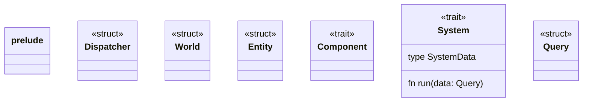

# GE2d-ECS

---
scribble notes



```rust
impl System for PosPlayerSys {
    type SystemData = (Position, mut Player)

    fn run(data: Query<SystemData>) {
        data.iter_mut(|(...)| )
    }
}

impl Dispatcher {
    run_system(system: System) {
        let systemData = data; // SystemData-Tuple
        let query_data = components.filter(type in systemData)
        system.run(query_data)
    }
}
```
